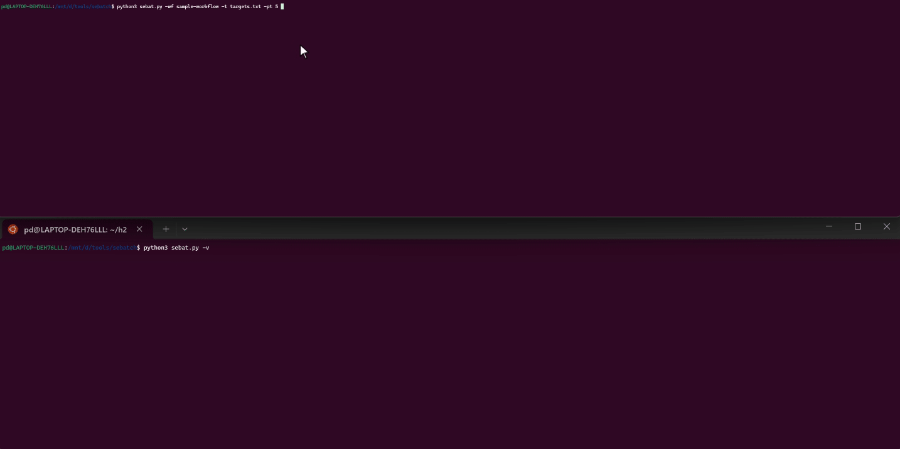

# Sebatch 

> Sebatch (*Batch*ing *s*can *e*ngine)is made for those who like to multitask. One cigarette 🚬, and wait scans done!


Sebatch is a streamlined evolution of the classic oneliner tool, designed to run multiple security tools in parallel across many domains. Ideal for bug hunters who want efficient, configurable, and parallelized scanning. Just plug in your *favorite oneliner* or *hacking style* as a scanning workflow — and get started!

## Source of the problem
Sometimes we (or maybe just me?) want to create a single script for a one-for-all scan  so that everything runs in one workflow according to each person's hacking style. But the problem is, every time we want to add a new tool, we have to tweak the script again. That's why I created this sebatch tool. So, we just need to edit the workflow, then run it in a sebatch.

## 🚀 Features

| Feature | Description |
|---------|-------------|
| **Parallel Processing** | Run multiple domains, parallel steps in a workflow, and workflows simultaneously with customizable convergence configurations. |
| **YAML Configuration** | Easy to write with flexible command templates, as well as workflow visualization through diagrams. |
| **Smart Skipping** | Automatically skips steps with existing results (by default) for efficiency |
| **Re-scan** | Automatic rescan by specific step or all steps. |
| **Real-time Progress** | Live status updates during scanning with unique scan ID tracking |
| **Organized Output** | Automatic directory structure with date-based naming and category organization |
| **Advanced Log Management** | Built-in log reader, log clearing, and scan ID filtering capabilities |
| **Modular Workflows** | Create focused workflows that reference outputs from other workflows |
| **CIDR Support** | Automatic handling of CIDR notation in target files |

## 👀 Show Case




## 🛠️ Installation

1. **Clone the repository:**
   ```
   git clone https://github.com/xcapri/sebatch.git
   cd sebatch
   ```

2. **Install Python dependencies:**
   ```
    # create virtual environment
    python3 -m venv venv

    # Activated virtual environment
    source venv/bin/activate

    # Install all packages from requirements.txt
    pip3 install -r requirements.txt
   ```

## 📝 Quick Start

### 1. Create a targets file
```
echo "example.com" > targets.txt
echo "test.org" >> targets.txt
```

### 2. Show available workflows
```
python3 sebat.py -sn
```

### 3. Run a workflow
```
python3 sebat.py -wf sample-workflow -t targets.txt
```

### 4. Run with selective rescan
```
python3 sebat.py -rs nuclei -wf sample-workflow -t targets.txt
```


## 📚 Documentation
💡 **Need more examples?** Check out the **[Technical Guide](docs/technical-guide.md)** for advanced usage, workflow templates, and troubleshooting tips.


## 🤝 Contributing

> I'm sure you have your own kitchen secrets. Feel free to put them into a workflow; Sebatch will help run it. However, if you want to share directly, please make a Pull Request.

1. Fork the repository
2. Create a feature branch
3. Add your workflow configurations
4. Submit a pull request

## 📄 License

This project is licensed under the MIT License - see the LICENSE file for details.

## 🙏 Acknowledgments

The predecessor tools that inspired the creation of sebatch tools.

- [Trickest](https://trickest.com/)
- [ProjectDiscovery](https://projectdiscovery.io/)
- [Awesome One-liner Bug Bounty](https://github.com/dwisiswant0/awesome-oneliner-bugbounty)
- The bug bounty community for inspiration and feedback

## 🔗 Similar Tools
- [EWE - Execution Workflow Engine](https://github.com/justakazh/ewe) 
- [Termaid is a term (pun intended) for Terminal-Mermaid](https://github.com/MKlolbullen/termaid) 
- [Execute Trickest workflows right from your terminal](https://github.com/trickest/trickest-cli) 
- etc.

---

**Happy scanning! 🚬💨 Remember: One cigarette, and wait scans done!** 
