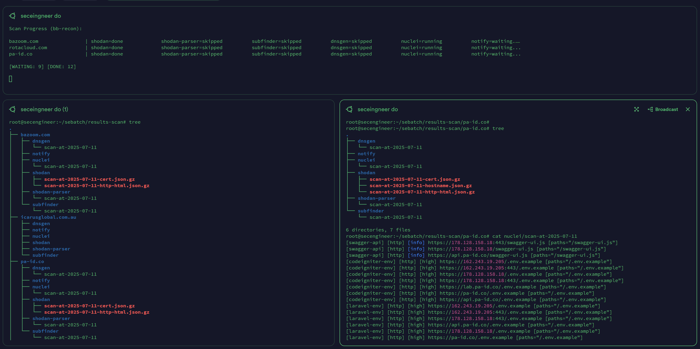

# Sebatch 
> Sebatch (batching scan) is made for those who like to multitask. One cigarette 🚬, and wait scans done!** 

The 'oneliner runner' tool lets you run multiple security scans in parallel across multiple domains. Perfect for security researchers, penetration testers, and bug hunters who want to maximize their scanning efficiency. It's actually a more managed development of oneliner. So just enter your flagship oneliner as the scan workflow config and run scans in parallel.

## 🚀 Features

- **Parallel Processing**: Run multiple domains simultaneously
- **YAML Configuration**: Easy-to-write scan workflows
- **Organized Output**: Automatic directory structure with date-based naming
- **Smart Skipping**: Automatically skips steps with existing results (by default)
- **Force Re-scan**: Use `-rs` flag to re-run all steps regardless of existing results
- **Real-time Progress**: Live status updates during scanning
- **Flexible Categories**: Group tools by category (subdomain, vuln-scanner, etc.)
- **Log Management**: Built-in log reader and log clearing functionality

## 👀 Show Case



## 🛠️ Installation

1. **Clone the repository:**
   ```
   git clone https://github.com/xcapri/sebatch.git
   cd sebatch
   ```

2. **Install Python dependencies:**
   ```
    # create virtual environment
    python3 -m venv venv

    # Activated virtual environment
    source venv/bin/activate

    # Install all packages from requirements.txt
    pip3 install -r requirements.txt
   ```

## 📝 Usage

### Basic Usage

1. **Create a targets file:**
   ```
   echo "example.com" > targets.txt
   echo "test.org" >> targets.txt
   echo "demo.net" >> targets.txt
   ```

2. **Show available workflows:**
   ```
   python3 sebat.py -sn
   ```

3. **Run a specific workflow:**
   ```
   python3 sebat.py -wf sample-workflow -t targets.txt
   ```

4. **Run multiple workflows:**
   ```
   python3 sebat.py -wf workflow1,workflow2 -t targets.txt
   ```

5. **Run all workflows:**
   ```
   python3 sebat.py -t targets.txt
   ```

### Advanced Usage

```
# Run with custom parallel targets (default: 3)
python sebat.py -wf sample-workflow -t targets.txt -pt 5

# Run all workflows with 10 parallel targets
python sebat.py -t targets.txt -pt 10

# Run multiple workflows in parallel (2 workflows at once)
python sebat.py -wf workflow1,workflow2 -t targets.txt -pw 2

# Run all workflows with parallel targets and workflows
python sebat.py -t targets.txt -pt 5 -pw 3

# Force re-scan all steps (ignore existing results)
python sebat.py -rs -wf sample-workflow -t targets.txt
```

### Log Management

```
# View logs in real-time (log reader mode)
python sebat.py -v

# Clear all debug log files
python sebat.py -cl
```

## 📋 Command Line Options

| Option | Description | Required |
|--------|-------------|----------|
| `-t, --targets` | File containing target domains | Yes* |
| `-pt, --parallel-targets` | Number of targets to process in parallel | No (default: 3) |
| `-pw, --parallel-workflows` | Number of workflows to process in parallel | No (default: 1) |
| `-rs, --rescan` | Force re-scan all steps (ignore existing results) | No |
| `-sn, --show-names` | Show available workflow names | No |
| `-wf, --workflow` | Specific workflow name(s), comma-separated | No (runs all if not specified) |
| `-v, --verbose` | Show logs in real-time (log reader mode) | No |
| `-cl, --clear-logs` | Clear all debug log files | No |

*Required for scanning operations, not required for `-sn`, `-v`, or `-cl` options.

## 📄 YAML Workflow Configuration

### Basic Structure

```yaml
name: My Security Scan
reference: https://example.com/blog/post
pipeline:
  - name: subfinder
    cat_base: subdomain
    output_file: # Optional prefix
    command: subfinder -silent -d {domain} -o {output_file}
  
  - name: nuclei
    cat_base: vuln-scanner
    output_file: # Optional prefix
    command: nuclei -tags xss,sqli -silent -l subfinder.output_file -o {output_file}
```

### Configuration Options

| Field | Description | Required |
|-------|-------------|----------|
| `name` | Workflow name | Yes |
| `reference` | Reference URL or documentation | No |
| `pipeline` | List of scanning steps | Yes |
| `cat_base` | Category for organizing results | No |
| `output_file` | Optional prefix for output files | No |
| `command` | Command to execute | Yes |

### Special Placeholders

- `{domain}` - Passing Target domain
- `{output_file}` - Generated output file path (default: result will be saved in result-scan/{cat_base}/{pipeline_name}/{domain}-{output_file})
- `{step_name}.output_file` - Reference to previous step's output

## 📊 Output Structure

Results are automatically organized by domain and category:
Its flexible based on your scans-workflow configuration.

```
results-scan/
└── example.com/
    ├── subdomain/
    │   ├── subfinder/
    │   │   └── scan-at-2024-06-08
    │   └── subdosec/
    │       └── scan-at-2024-06-08
    ├── vuln-scanner/
    │   └── nuclei/
    │       └── scan-at-2024-06-08
    ├── httpx/
    │   └── scan-at-2024-06-08
    └── notify/
        └── scan-at-2024-06-08
```

## 🔧 Creating Custom Workflows

### Example: Subdomain Enumeration + Vulnerability Scanning

```yaml
name: Subdomain Recon + Vuln Scan
pipeline:
  - name: subfinder
    cat_base: subdomain
    command: subfinder -silent -d {domain} -o {output_file}
  
  - name: httpx
    output_file: # use output_file to custom prefix
    cat_base: web # you can leave blank
    command: cat subfinder.output_file | httpx -silent -o {output_file}
  
  - name: nuclei
    cat_base: vuln-scanner
    command: cat httpx.output_file | nuclei -silent -o {output_file}

  - name: testcommand
    cat_base: vuln-scanner
    command: |
    echo {domain} | another command | another command &&
    cat httpx.output_file | nuclei -silent -o {output_file}

    .. add more tools 
```

## 🤝 Contributing

> I'm sure you have your own kitchen secrets. Feel free to put them into a workflow; Sebatch will help run it. However, if you want to share directly, please make a Pull Request.

1. Fork the repository
2. Create a feature branch
3. Add your workflow configurations
4. Submit a pull request

## 📄 License

This project is licensed under the MIT License - see the LICENSE file for details.

## 🙏 Acknowledgments

- [ProjectDiscovery](https://projectdiscovery.io/) for amazing security tools
- [Awesome One-liner Bug Bounty](https://github.com/dwisiswant0/awesome-oneliner-bugbounty)
- The bug bounty community for inspiration and feedback

---

**Happy scanning! 🚬💨 Remember: One cigarette, and wait scans done!** 
